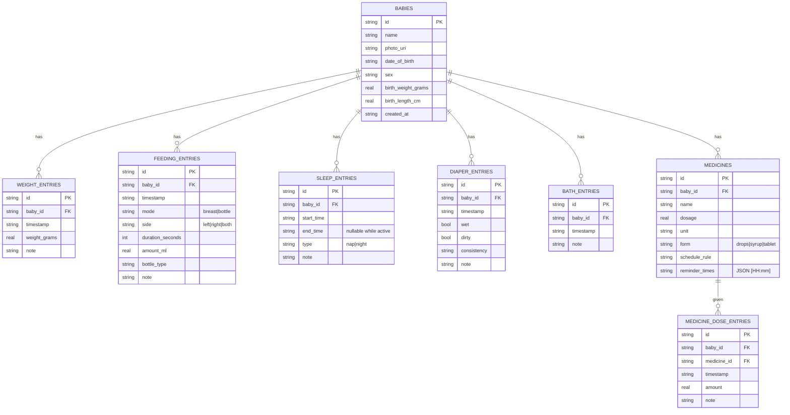

# LittleLog 🍼

A warm, offline-first **baby routine tracker** built with Expo. Log feeds, sleep,
diapers, baths, weight and medicines in one tap, review trends, and manage
reminders — everything stored locally on device, no backend required.

## Features

- **Multi-baby profiles** (twins welcome) with a header profile switcher and
  natural age display ("3 days old" → "6 weeks old" → "4 months old" → "1 yr 2 mo old")
- **Quick-log dashboard**: 6 tracker cards with live "last logged" summaries +
  a "Today" timeline grouped by hour (long-press any history row to edit/delete)
- **Feeding** — breast (per-side stopwatch with pause/switch sides, survives app
  restarts) or bottle (amount + breast milk / formula / mixed)
- **Sleep** — start/stop timer or manual entry, auto nap/night classification,
  7/30-day bar chart, nap count & longest stretch stats
- **Weight** — growth line chart (birth weight included) with kg/lb unit toggle
- **Diaper & Bath** — one-tap wet/dirty chips, consistency notes, last-bath summary
- **Medicines** — per-baby medicine list, dose logging, daily reminder schedules via
  local notifications; tapping a reminder deep-links into "mark as given"
- **Settings** — kg/lb + ml/oz units, reminder master switch, CSV/JSON export via
  the share sheet, light/dark mode

## Stack

| Layer | Choice |
|---|---|
| Framework | Expo SDK 57 · Expo Router (file-based nav, typed routes) |
| Language | TypeScript strict (no `any` in the data layer) |
| Styling | NativeWind 4 (Tailwind) with tokens in `tailwind.config.js` |
| Storage | `expo-sqlite` (WAL, versioned migrations) + zod validation at the DB boundary |
| State | Zustand (+ `persist` → AsyncStorage) for active baby, units, running timers |
| Charts | `react-native-gifted-charts` (line + bar) |
| Notifications | `expo-notifications` (daily calendar triggers, Android channel) |
| Tests | Vitest for pure utils (age formatting boundaries, unit conversions) |

## Run it

This repo uses **Bun** (`bun.lock`). Development runs through an **Expo dev build**
(`expo-dev-client`), not Expo Go.

```bash
bun install
bunx expo run:ios        # first time: builds the dev client, then boots it (or run:android)
# afterwards:
bunx expo start          # dev server -> open in the installed dev client
```

EAS profiles in `eas.json`: `development`, `development-simulator`, `preview`, `production`
(`eas build -p ios --profile development-simulator` for a cloud-built dev client).

- Web: supported (`wa-sqlite` WASM asset is wired in `metro.config.js`);
  haptics degrade gracefully.
- Medicine reminders use local notifications; grant permission when prompted or
  enable them later in Settings.

Checks:

```bash
bunx tsc --noEmit     # type check (strict)
bunx vitest run       # unit tests (age boundaries, conversions, durations)
bunx eslint src       # eslint (expo config)
CI=1 bunx expo export --platform web   # bundler smoke test
```

## Project structure

```
src/
  app/                    # routes ONLY (Expo Router)
    _layout.tsx           #   db init gate + theme + modal presentations
    (tabs)/               #   Today · History · Medicines · Settings
    log/[type].tsx        #   quick-log modal (feeding/sleep/diaper/bath/weight/medicine)
    baby/[id]/edit.tsx    #   add/edit profile ('new' to create)
  screens/                # screen bodies rendered by routes
    dashboard/            #   quick-log grid, timer banners, Today timeline
    history/              #   filters, growth chart, sleep chart, entry editor
    log/                  #   one form component per tracker + live timer
    medicines/            #   list + editor w/ schedule picker
    settings/             #   units, reminders, profiles, export
    baby-edit/
  components/ui/          # design-system primitives (Button, Card, Chip, …)
  components/             # profile-switcher
  db/                     # sqlite client, migrations, zod schemas, repos,
                          # change-bus + reactive query hooks
  stores/                 # zustand: babies / settings / timers
  utils/                  # age · units · datetime (pure, unit-tested), haptics
  notifications/          # permission flow, scheduling, deep-link handler
CONTRACTS.md              # module ownership + API contract used during the build
```

## Data model

Canonical storage: weights in **grams**, volumes in **milliliters**, timestamps
as ISO-8601 UTC strings. Display units are applied at the edge via `src/utils/units`.



### Reactivity without a backend

Every write goes through a repository function that calls `notifyDbChanged()` after
commit. Hooks like `useTodaySnapshot`, `useTimelineDay` and `useDbQuery` subscribe
to that tiny event bus (`src/db/change-bus.ts`) and refetch — simple, deterministic
offline-first reactivity with no external cache layer.

### Running timers survive restarts

The sleep stopwatch and the breast-feed session live in `useTimersStore`, persisted
to AsyncStorage. Stopping a timer writes the finished entry through the normal
repository path (with double-stop guards).

## Deliberate scope decisions

- WHO/CDC percentile bands are intentionally skipped; the growth view shows a clean
  trend line with first/latest summary cards, labeled "not medical advice".
- Dose-adherence (given vs scheduled) views are not included; dose history is listed.
- Both can be added later without schema changes.
